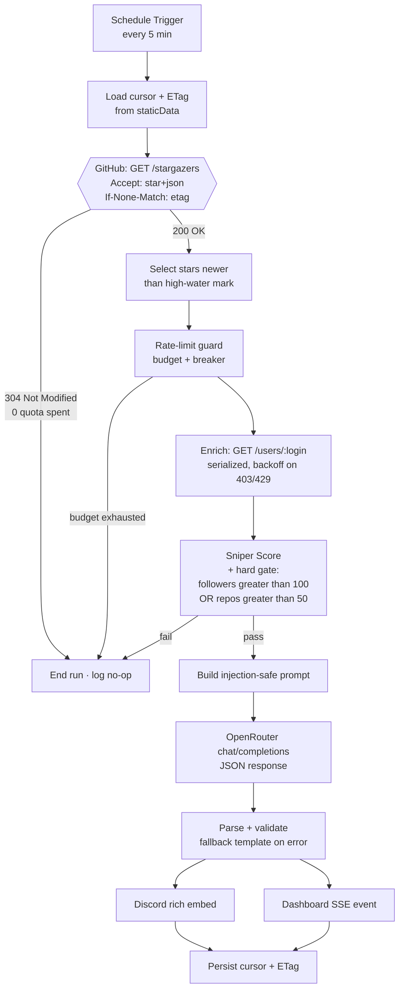

# Lead Sniper — Build Plan

**Assignment 1 · AI Intern · Yellow.ai**
Stack decision: **n8n (self-hosted) → OpenRouter → Discord**, plus a live local mission-control dashboard.

---

## 0. The thesis

The assignment can be satisfied by six nodes wired in a line. Almost every submission will be
exactly that, and every one of them will look the same.

This build wins on four axes a reviewer can verify in under two minutes:

| Axis | What most submissions do | What we do |
|---|---|---|
| **Trigger correctness** | Poll page 1 of `/stargazers` | Page 1 is the *oldest* stars. We walk the `Link: rel="last"` cursor and request `Accept: application/vnd.github.star+json` to get `starred_at` at all. |
| **Rate limits** (explicitly graded) | "I added a 1s Wait node" | Authenticated PAT (83× quota), ETag conditional requests where **304 costs zero quota**, a live budget circuit-breaker, serialized fan-out for secondary limits, and `Retry-After`-aware backoff. |
| **The AI piece** | "Write a sentence about this user" | Structured JSON output, injection-hardened prompt (a GitHub bio is untrusted input), deterministic temperature, and a template fallback so the flow never dies on the LLM. |
| **Presentation** | A screenshot of a Discord message | A live HUD dashboard that animates as the workflow runs — funnel, draining rate-limit gauge, scored lead cards, streaming event log. This is the demo recording's money shot. |

The single highest-leverage idea: **make the hard part visible.** Rate-limit handling is the graded
deliverable, and it is invisible in a Discord screenshot. So we put a live quota gauge on screen.

---

## 1. Architecture



Every stage also emits a telemetry event to the dashboard, so the funnel and the log are populated
from the *real* run, not a mock.

---

## 2. Repository layout

```
lead-sniper/
├─ README.md                        # front door: what, why, how to run, screenshots
├─ LOGIC-LOG.md                     # ← graded submission requirement #3
├─ PLAN.md                          # this file
├─ .env.example                     # every secret named, none committed
├─ package.json                     # zero runtime deps; scripts only
│
├─ workflow/
│  ├─ lead-sniper.workflow.json     # ← graded submission requirement #1
│  └─ nodes/                        # every Code node's source, readable in a diff
│     ├─ 01-select-new-stargazers.js
│     ├─ 02-ratelimit-guard.js
│     ├─ 03-score-and-filter.js
│     ├─ 04-build-pitch-prompt.js
│     ├─ 05-parse-pitch.js
│     └─ 06-build-discord-embed.js
│
├─ dashboard/
│  ├─ server.js                     # Node stdlib only: static + POST /event + GET /stream (SSE)
│  ├─ public/index.html             # the HUD
│  └─ data/events.json              # rolling run history, seeds the UI on load
│
├─ scripts/
│  ├─ preflight.js                  # validate env, ping GitHub/OpenRouter/Discord, print quota
│  ├─ mock-github.js                # local GitHub API stand-in → demo with no network/token
│  └─ replay.js                     # replay a recorded run into the dashboard, for filming
│
├─ docs/
│  ├─ ARCHITECTURE.md               # node-by-node walkthrough + failure modes
│  ├─ YELLOW-AI-PORT.md             # how this maps onto Yellow.ai Studio, 1:1 by node
│  ├─ DEMO-SCRIPT.md                # shot list + narration for the recording
│  └─ screenshots/
│
└─ submission/                      # exactly the four graded artifacts, zipped-ready
```

Why the Code-node sources live as real `.js` files: a reviewer should not have to open n8n and
click six nodes to read the logic. They should be able to read it in the repo. The build step
inlines them into the workflow JSON.

Why zero npm dependencies: `git clone && npm run preflight` must work on a reviewer's machine
with no install step and no lockfile drift.

---

## 3. The workflow, node by node

Target repo: `tiangolo/fastapi` (high, steady star velocity — good for a live demo).
Configurable via a single `Set` node at the top so it can be pointed anywhere on camera.

### N1 · Schedule Trigger
Every 5 minutes. Not 1 minute: with ETags an unchanged poll is free, but the enrichment fan-out
is not, and 5 min keeps us comfortably inside the secondary-limit envelope while still feeling
"live" in a demo. A **Manual Trigger** is wired in parallel so the demo can be fired on cue.

### N2 · Load state (Code)
Reads `$getWorkflowStaticData('global')`:
- `lastStarredAt` — ISO high-water mark, the dedupe cursor.
- `stargazersEtag` — ETag from the previous listing response.
- `seenLogins` — bounded ring buffer (cap 500) guarding against clock-skew duplicates.
- `budget` — remaining/reset snapshot carried between runs.

First run has no cursor, so it seeds from "now minus 24h" rather than replaying 80,000 historical
stargazers. That bootstrap guard is a real bug most implementations ship.

### N3 · Fetch stargazers (HTTP Request)
```
GET /repos/{owner}/{repo}/stargazers?per_page=100&page={LAST}
Accept:        application/vnd.github.star+json     ← without this there is no starred_at
If-None-Match: {stargazersEtag}
Authorization: Bearer {PAT}
X-GitHub-Api-Version: 2022-11-28
```
Two non-obvious details, both worth calling out in the Logic Log:

1. **`Accept: application/vnd.github.star+json`** changes the response shape from a bare user array
   to `[{ starred_at, user }]`. Without it there is no timestamp and no way to dedupe by time.
2. **Stargazers are returned oldest-first.** Polling page 1 forever returns 2018's stargazers.
   We do a `per_page=1` HEAD-ish probe, read `Link: <...&page=N>; rel="last"`, then fetch that
   last page at `per_page=100`. Two cheap requests instead of paginating the whole history.

Node config: `neverError: true` so a 304 reaches our own branching logic instead of throwing;
`fullResponse: true` so we can read status + headers.

### N4 · 304 branch (IF)
`statusCode === 304` → straight to the "no new stars" terminal, logging `0 quota spent`.
This is the path that runs most of the time and it is the whole point of the ETag work.

### N5 · Select new stargazers (Code)
Filter to `starred_at > lastStarredAt` AND `login ∉ seenLogins`. Sort ascending. Cap at
`MAX_ENRICH_PER_RUN` (default 20) so one viral spike cannot drain the hour's quota in a single run;
the overflow is simply picked up by the next poll because the cursor only advances over what we
actually processed.

### N6 · Rate-limit guard (Code)
Reads `x-ratelimit-remaining` / `x-ratelimit-reset` off N3's response.
- `remaining < RESERVE (250)` → **circuit open**: emit a telemetry event, end the run cleanly,
  do not advance the cursor. The next scheduled poll retries after reset.
- Otherwise pass through with a computed per-item budget.

Ending *cleanly* rather than erroring matters: an errored n8n execution needs manual intervention,
a clean end self-heals on the next tick.

### N7 · Split In Batches → Enrich (HTTP Request)
`GET /users/{login}` with `batchSize: 1` and a `Wait` of 800 ms between batches.

This serialization is aimed at GitHub's **secondary** rate limits, which are about concurrency and
burst rather than the hourly quota — you can be well under 5,000/hr and still get a 403 for firing
30 parallel requests. n8n's default is to fan out all items at once, so this is a deliberate
override, not a default.

Retry: `retryOnFail`, 3 tries, `waitBetweenTries` 2000 ms, plus a Code-node backoff that honours
`Retry-After` when present and otherwise uses `2^n × 1000 ms + jitter` for 403/429/5xx.
Per-login ETags are cached in staticData too, so re-seeing a user costs zero quota.

### N8 · Sniper Score + filter (Code)
**Hard gate, exactly as specified:** `followers > 100 || public_repos > 50`. Fails → flow stops.

Layered on top, a 0–100 **Sniper Score** used only for ranking and presentation:

| Signal | Weight | Rationale |
|---|---|---|
| `log10(followers)` normalised | 30 | Influence, log-scaled so 10k doesn't swamp everything |
| `public_repos` normalised | 15 | Builder, not lurker |
| Account age | 10 | Established > brand-new |
| `updated_at` recency | 10 | Currently active |
| Contactable (`email`/`blog`/`twitter`) | 10 | Can we actually reach them |
| `company` present | 10 | B2B buying context |
| **ICP keyword match in bio** | 15 | `ai, llm, agent, chatbot, conversational, cx, support, automation, nlp` — Yellow.ai's actual ICP |

Tiers: **🔥 HOT ≥ 75 · ⚡ WARM 50–74 · 💤 COLD < 50**.

This is the "product thinking" beat: the spec's boolean gate answers *may we contact them*; the
score answers *who do we call first*, which is the question a sales team actually has.

### N9 · Build prompt (Code)
The bio and company fields are **attacker-controlled text** — anyone can put
`Ignore previous instructions and…` in their GitHub bio. So:
- untrusted fields are wrapped in explicit `<bio>` / `<company>` delimiters,
- the system prompt states that delimited content is data to be summarised, never instructions,
- newlines/backticks in the fields are normalised before interpolation.

Prompt asks for strict JSON: `{ "pitch": string, "angle": string, "confidence": 0-1 }`,
pitch ≤ 30 words, one sentence, no invented facts, and the literal string
`"no public signal"` when bio and company are both empty.

### N10 · OpenRouter (HTTP Request)
```
POST https://openrouter.ai/api/v1/chat/completions
Authorization: Bearer {OPENROUTER_API_KEY}
HTTP-Referer / X-Title:  attribution headers (OpenRouter convention)
body: { model, messages, temperature: 0.2, max_tokens: 160,
        response_format: { type: "json_object" } }
```
Model: a fast, cheap instruct model; the exact id lives in an env var so it can be swapped without
touching the workflow. `temperature: 0.2` because we want a consistent pitch on a re-run during the
recording, not creative variance.

Placed **after** the filter, never before — a rejected lead costs zero tokens. Worth one line in
the Logic Log: the cheapest LLM call is the one you don't make.

### N11 · Parse + fallback (Code)
Strip markdown fences, `JSON.parse` in a guarded block, validate shape and length.
On any failure, fall back to a deterministic template built from real profile fields and mark the
card `pitch_source: "fallback"`. **The LLM is never a single point of failure for the alert.**

### N12 · Discord embed (HTTP Request → webhook)
Rich embed, colour keyed to tier (amber HOT / cyan WARM / slate COLD):
avatar thumbnail, name + `@login` title linking to their profile, tier + score in the author line,
bio, inline fields for followers / repos / company / location / starred-at, the AI pitch in its own
field, and a footer carrying model id + score breakdown. Rate-limited to 5 embeds per message batch.

### N13 · Persist state (Code)
Advance `lastStarredAt`, store new ETags, push logins into the ring buffer.
**Written last**, only after successful delivery, so a mid-run failure re-processes rather than
silently skipping a lead. At-least-once beats at-most-once for sales leads.

### N14 · Telemetry (HTTP Request, fire-and-forget)
`POST http://localhost:8787/event` at every stage. `neverError: true` and no retries — the
dashboard being down must never break the pipeline.

---

## 4. Rate-limit strategy (the graded deliverable)

`LOGIC-LOG.md` will be written as a short engineering memo, not a checklist. Its spine:

**Tier 1 — don't need the quota.**
`If-None-Match` conditional requests. GitHub returns `304 Not Modified` when the stargazer listing
hasn't changed, and **a 304 does not decrement the rate limit**. On a repo with a star every few
minutes, most of our polls are free. This is the most under-used lever in the GitHub API and it is
where the memo opens.

**Tier 2 — have more quota.**
Authenticated PAT: 5,000 req/hr versus 60 req/hr unauthenticated, per IP. An 83x increase for one
header. Any implementation that skips auth is capped at roughly one poll per minute in total,
across everything it does.

**Tier 3 — spend less of it.**
- `per_page=100` — 100x fewer requests per page of history.
- `Link: rel="last"` cursor to jump to the newest stars instead of paginating from the start.
- `MAX_ENRICH_PER_RUN` cap so a viral spike is spread across polls instead of draining an hour.
- Per-login ETag cache on enrichment.
- Filter before the LLM: no tokens spent on unqualified leads.

**Tier 4 — never get 403'd.**
- Serialized fan-out (`batchSize: 1` plus an 800 ms wait) for **secondary** limits, which are
  concurrency-based and fire well below the hourly quota.
- Honour `Retry-After`; otherwise exponential backoff with jitter on 403 / 429 / 5xx.

**Tier 5 — fail safe when we do run low.**
Read `x-ratelimit-remaining` and `x-ratelimit-reset` on every response. Below a 250-request reserve,
open the circuit: log it, end the execution cleanly, leave the cursor unadvanced. It self-heals on
the next tick with zero manual intervention. The reserve exists so a concurrent manual run, or
another tool sharing the token, cannot push us to a hard zero mid-flight.

**Made visible.** The dashboard's quota gauge renders `x-ratelimit-remaining` live, with the reset
countdown and a colour shift at the reserve threshold — so the reviewer *sees* the mechanism during
the demo instead of taking the memo's word for it.

---

## 5. The dashboard — "Mission Control"

A dark tactical-HUD console at `http://localhost:8787`. Node stdlib only: static file serving,
`POST /event` for ingest, `GET /stream` for Server-Sent Events. No build step, no framework, no CDN.

**Why it exists (stated honestly in the README):** the assignment's output is a Discord message, and
a Discord message hides the interesting 90% of the system. The dashboard is the observability layer
— it renders the funnel, the quota and the scoring that a chat message cannot.

### Layout

```
+--------------------------------------------------------------------------+
| (o) LEAD SNIPER   watching tiangolo/fastapi   > LIVE  poll #14  22:41:07  |
+--------------------------------------------+-----------------------------+
|  GITHUB API BUDGET                         |  SESSION                    |
|  ####################......  4,712 / 5,000 |  leads/hr      6            |
|  resets in 23:41  ·  12 polls · 9 x 304    |  avg score    78            |
|  ^ 304s saved 900 requests this hour       |  tokens     1,340           |
+--------------------------------------------+-----------------------------+
|  ACQUISITION FUNNEL                                                      |
|  scanned 100 > new 7 > enriched 7 > qualified 3 > pitched 3 > sent 3      |
|  ############  ########  #######  ####  ####  ####        43% qualify    |
+--------------------------------------------------------------------------+
|  .-- TARGETS ACQUIRED --------------------------------------------------. |
|  | (avatar)  monalisa octocat  @octocat            .---.    HOT         | |
|  |           GitHub · San Francisco                | 92|               | |
|  |           starred 2m ago                        '---'               | |
|  |  followers 120   repos 52   reachable   since 2008                  | |
|  |  "Design and build all the things. Interested in Open Source..."    | |
|  |  .-- AI PITCH -----------------------------------------------.      | |
|  |  | Builds developer tooling at GitHub and follows AI closely  |     | |
|  |  | — a natural fit for our agent platform.                    |     | |
|  |  '------------------------- openrouter · confidence 0.86 ----'      | |
|  |  delivered to #leads · 22:41:09                   [ raw json ]      | |
|  '---------------------------------------------------------------------' |
+--------------------------------------------------------------------------+
|  EVENT STREAM                                                            |
|  22:41:02  POLL     GET /stargazers            304   0 quota             |
|  22:41:07  POLL     GET /stargazers            200  -1  ·  7 new         |
|  22:41:08  ENRICH   GET /users/octocat         200  -1                   |
|  22:41:08  SCORE    octocat  92  HOT           gate: followers 120 > 100 |
|  22:41:09  AI       openrouter  412 tok  0.9s  confidence 0.86           |
|  22:41:09  SEND     discord webhook            204  ok                   |
|  22:41:09  SKIP     devnull42  score 21        gate failed               |
+--------------------------------------------------------------------------+
```

### Design language
- Near-black `#07090c` ground, faint grid, generous negative space. Deliberately a single dark
  design, painted explicitly rather than inherited — a tactical console should not have a light mode.
- One signal colour: amber `#f5b301` means target acquired. Cyan for data and telemetry, red only
  for quota danger. Restraint is what separates "designed" from "themed".
- `ui-monospace` for all numerics and the log, a clean sans for prose and pitches. Tabular numerals
  so gauge digits do not jitter as they count.
- Motion with intent: new lead cards sweep in with a highlight pass, funnel bars ease to width,
  score rings draw as SVG arcs, the reset timer ticks. Nothing decorative loops forever.
- Every card expands to raw profile JSON on click — proof the data is real, not seeded.

### Demo resilience
Seeded from `data/events.json` so it looks alive the instant it opens; `npm run replay` re-plays a
recorded run frame by frame for filming; `npm run mock` serves a local GitHub stand-in so the whole
pipeline is demonstrable with no token, no network and no quota.

---

## 6. Build phases

| # | Phase | Output | Gate |
|---|---|---|---|
| 0 | Scaffold and preflight | repo tree, `package.json`, `.env.example`, `preflight.js` | `npm run preflight` prints a clean checklist |
| 1 | Happy path | n8n flow: trigger to stargazers to enrich to gate to Discord | a real message lands in Discord |
| 2 | Rate-limit hardening | ETag, cursor, guard, backoff, batching | second poll returns 304, log shows `0 quota` |
| 3 | Score and AI | Sniper Score, injection-safe prompt, OpenRouter, fallback | pitch is one grounded sentence, JSON-valid |
| 4 | Discord polish | tiered rich embed | screenshot-grade output |
| 5 | Dashboard | server, HUD, SSE | funnel and gauge move during a live run |
| 6 | Docs | `README`, `LOGIC-LOG`, `ARCHITECTURE`, `YELLOW-AI-PORT` | a stranger can run it from the README alone |
| 7 | Record | `DEMO-SCRIPT.md`, screenshots, final export | four submission artifacts in `submission/` |

Phases 1 to 4 alone satisfy the assignment. 5 to 7 are what make it memorable.

---

## 7. Risks and how each is handled

| Risk | Handling |
|---|---|
| No new stars during the recording | Manual Trigger, `MOCK=1` mode, and `npm run replay`. The demo never depends on a stranger starring a repo on cue. |
| OpenRouter key or model unavailable mid-demo | Template fallback path; the alert still ships, visibly tagged `fallback`. |
| GitHub 403 secondary limit on camera | Serialized fan-out makes it unlikely, backoff makes it survivable, and the event log shows the retry — arguably a better demo. |
| n8n version drift breaking the import | Pin the version in the README and use only core nodes (HTTP Request, Code, IF, Split In Batches, Wait, Schedule). No community nodes, no vendor LLM node, so the JSON imports cleanly anywhere. |
| Secrets leaking into the submitted JSON | Credentials referenced by n8n credential id, never inlined. A scrub check greps the exported artifact for token-shaped strings before it reaches `submission/`. |
| Scope creep sinking the deadline | The phase gates above. Ship after phase 4 if time runs out. |

---

## 8. Yellow.ai port (documented, not built)

`docs/YELLOW-AI-PORT.md` maps each n8n node to its Yellow.ai Studio equivalent — schedule/event
trigger, API node for the GitHub calls, Variable and Condition nodes for the gate, the GenAI node
for the pitch, Integration node for Slack or Discord — and names what differs: where cursor state
would live, how the platform handles retries, and which parts of the rate-limit strategy have to
move.

It costs about an hour, and it means that when the interviewer asks "could you build this on our
stack?", the answer is a document rather than an opinion.

---

## 9. Submission checklist

- [ ] `submission/lead-sniper.workflow.json` — importable, scrubbed of secrets
- [ ] `submission/discord-success.png` — the delivered alert
- [ ] `submission/LOGIC-LOG.md` — the rate-limit memo
- [ ] `submission/demo.mp4` — recorded per `docs/DEMO-SCRIPT.md`
- [ ] Bonus: dashboard screenshots, `YELLOW-AI-PORT.md`, public repo link
