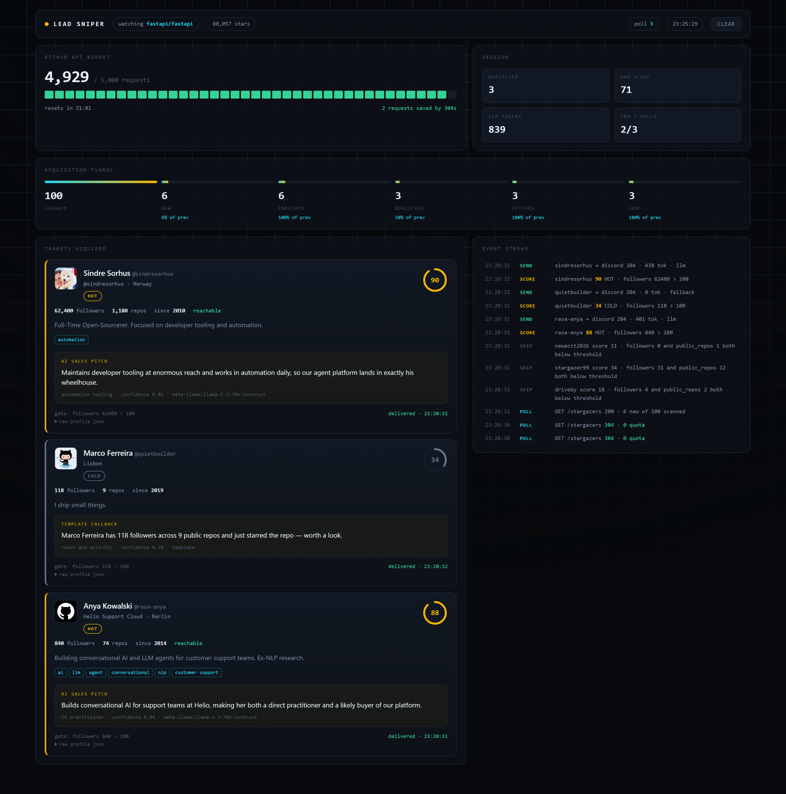
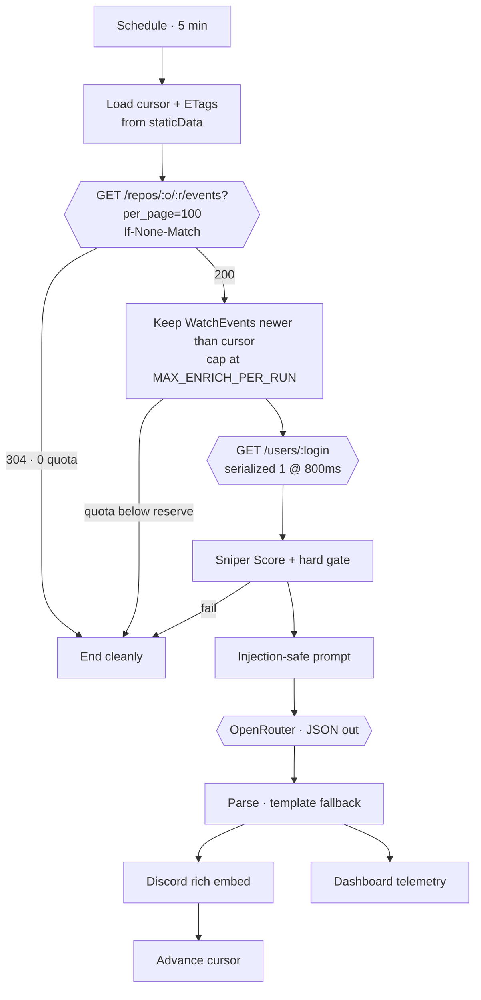

# Lead Sniper

**When someone influential stars your repo, you want to know within five minutes — and you want
to know why they're worth a call.**

An n8n workflow that watches a GitHub repository's stargazers, enriches each new star with the
full user profile, filters for high-value leads, has an LLM write a one-sentence sales pitch
grounded in their actual bio, and posts the result to Discord — with a live mission-control
dashboard so you can watch the pipeline work.

> Assignment 1 · AI Intern · built on n8n + OpenRouter + Discord



---

## What's interesting here

Six nodes in a line satisfies the brief. These are the parts that took actual thought:

**The documented endpoint doesn't work, and finding out why took real digging.**
`GET /repos/:owner/:repo/stargazers` returns **404 for every repo you do not own** — verified
across repos from 5 stars to 204,000, with a token carrying `repo`, `user` and `admin:org`.
It is not a permissions gap: `x-accepted-oauth-scopes` comes back empty, anonymous requests get
401, and `/forks`, `/contributors` and `/topics` on the same repo all return 200. GraphQL agrees —
`stargazerCount` reports 102,246 for `fastapi/fastapi` while the `stargazers` connection returns
`totalCount: 0`. It's a deliberate anti-scraping lockdown, aimed at roughly this use case.

So the trigger reads the **repository events feed** instead, where every star arrives as a
`WatchEvent`. That turned out better than the original: it works on any public repo, comes back
newest-first (no pagination walk), costs one request per poll instead of two, still supports ETag
revalidation, and GitHub volunteers an `X-Poll-Interval` header telling you how often it wants to
be polled. The full investigation is in [LOGIC-LOG.md](LOGIC-LOG.md).

**Most polls cost zero API quota.** Conditional requests with `If-None-Match` return `304 Not
Modified`, which does not decrement the rate limit. The full strategy is in
[LOGIC-LOG.md](LOGIC-LOG.md) — the graded deliverable.

**A GitHub bio is untrusted input.** Anyone can set theirs to *"ignore previous instructions
and…"*, and it reaches the model verbatim. Untrusted fields are delimiter-stripped and wrapped,
and the system prompt declares them as data. There's a test for it.

**The LLM is never a single point of failure.** Malformed JSON, a dead model, a rate limit — any
of them falls through to a template built from fields already fetched. The alert still ships,
tagged `fallback`.

**The spec's gate answers the wrong question.** `followers > 100 OR public_repos > 50` (kept
exactly as specified) tells you *may we contact them*. A sales team actually asks *who do we call
first*, so a 0–100 Sniper Score ranks what gets through — weighting ICP keywords in the bio,
reachability, tenure and recency alongside raw reach.

---

## Quick start

```bash
npm run preflight    # validates every credential, prints your live GitHub quota
npm test             # runs all 8 Code nodes against fixtures — no n8n needed
npm run build        # generates the importable workflow JSON
npm run dashboard    # http://localhost:8787
```

There are **no dependencies**. Nothing to install; Node 18+ is all you need.

### 1. Credentials

```bash
cp .env.example .env
```

Fill in three things:

| Variable | Where |
|---|---|
| `GITHUB_TOKEN` | [github.com/settings/tokens](https://github.com/settings/tokens) — classic, no scopes needed for public repos |
| `OPENROUTER_API_KEY` | [openrouter.ai/keys](https://openrouter.ai/keys) |
| `DISCORD_WEBHOOK_URL` | Server Settings → Integrations → Webhooks → New Webhook → Copy URL |

The events feed does answer anonymous requests, but 60/hour is not a working budget: a 5-minute
schedule spends 12 polls an hour before any enrichment. So the token is effectively required, for
quota rather than access. `npm run preflight` will tell you if any of the three is wrong before
you touch n8n.

### 2. Import into n8n

```bash
npx n8n            # http://localhost:5678
npm run build      # writes workflow/lead-sniper.local.json
```

Import `workflow/lead-sniper.local.json` (Workflows → ⋯ → Import from File). Then create two
**Header Auth** credentials in n8n and attach them to the GitHub and OpenRouter nodes:

| Credential name | Header | Value |
|---|---|---|
| `GitHub PAT (Header Auth)` | `Authorization` | `Bearer ghp_…` |
| `OpenRouter (Header Auth)` | `Authorization` | `Bearer sk-or-v1-…` |

Secrets live in n8n's credential store, never in the workflow JSON. `npm run scrub` verifies the
committed artifact is clean.

### 3. Run it

Start the dashboard, hit **Run Once (Demo)** in n8n, and watch the funnel move.

> **Activate the workflow to see the interesting half.**
> n8n only persists workflow static data for production runs — never for manual ones. So every
> *Test workflow* click starts with an empty cursor and an empty ETag cache, which means the
> free-`304` revalidation path **cannot fire on a manual run**. Toggle the workflow **Active** and
> let the 5-minute schedule tick twice: the first poll is a `200`, the second a `304` costing zero
> quota. A cold start is capped at `COLD_START_MAX_LEADS` (3) so it stays readable either way.

---

## Running with no credentials at all

The whole pipeline is demonstrable offline:

```bash
npm run mock         # stand-ins for all three services on :8788
```

One server covers every external dependency, so no token, key or webhook is required:

| Endpoint | Stands in for | Behaviour |
|---|---|---|
| `/repos/:o/:r/events` | GitHub | `WatchEvent`s mixed with pushes and forks, ETag revalidation returning a free `304`, `X-Poll-Interval`, a live `x-ratelimit-*` ledger, and a new stargazer every 20s |
| `/users/:login` | GitHub | full profile payloads, `404` for unknown logins |
| `/api/v1/chat/completions` | OpenRouter | OpenAI-shaped response, pitch built from the prompt it was actually sent |
| `/api/webhooks/:id/:token` | Discord | `204`, logging each embed it receives |

Point `Config.apiBase`, `Config.llmUrl` and `Config.discordWebhookUrl` at it and run the flow.

This is how the pipeline was verified: two consecutive `n8n execute` runs, the first returning
`200` with three delivered leads, the second a `304` costing **zero** quota — see
[`docs/screenshots/dashboard-live-run.png`](docs/screenshots/dashboard-live-run.png).
Note that `n8n execute` runs in `cli` mode, not `manual`, so static data persists and the
ETag path actually works; see the caveat under *Run it* above.

To drive just the dashboard — useful for filming — `npm run replay` plays a recorded run,
including two free 304 polls, three qualified leads and three rejections.

---

## How it works



Each Code node lives as a readable `.js` file in [`workflow/nodes/`](workflow/nodes/) and is
inlined into the workflow JSON at build time — so the logic is reviewable in a diff instead of by
clicking through eight nodes in the n8n editor.

| # | Node | Does |
|---|---|---|
| 01 | [prepare-poll](workflow/nodes/01-prepare-poll.js) | Loads cursor + ETags, bootstraps first run |
| 03 | [select-new-stargazers](workflow/nodes/03-select-new-stargazers.js) | Keeps `WatchEvent`s, cursor filter, dedupe, budget cap, circuit breaker |
| 04 | [score-and-filter](workflow/nodes/04-score-and-filter.js) | Sniper Score + the assignment's hard gate |
| 05 | [build-prompt](workflow/nodes/05-build-prompt.js) | Prompt-injection hardening |
| 06 | [parse-pitch](workflow/nodes/06-parse-pitch.js) | Strict JSON parse + template fallback |
| 07 | [discord-embed](workflow/nodes/07-discord-embed.js) | Tiered rich embed |
| 08 | [persist-state](workflow/nodes/08-persist-state.js) | Advances the cursor after delivery |

### Scoring

The hard gate is exactly as specified — `followers > 100 || public_repos > 50`. The score only
ranks what passes:

| Signal | Weight |
|---|---|
| Followers (log-scaled, so one celebrity doesn't flatten everything) | 30 |
| Public repos | 15 |
| **ICP keywords in bio** — `ai`, `llm`, `agent`, `conversational`, `cx`, `customer support`… | 15 |
| Account tenure | 10 |
| Recent activity | 10 |
| Reachable (email / blog / twitter) | 10 |
| Has a company | 10 |

🔥 **HOT** ≥ 75 · ⚡ **WARM** 50–74 · 💤 **COLD** < 50

The effect is deliberate: a support-AI engineer with 840 followers outranks a 9,800-follower
account with an empty bio, because the first one is a buyer and the second is a number.

---

## Tests

`npm test` runs every Code node against fixtures in a stand-in for n8n's Code sandbox — no n8n,
no token, no live star required. 33 assertions covering the cursor, pagination, both sides of the
gate, ICP ranking, prompt-injection stripping, the JSON fallback, Discord's field limits, the
circuit breaker, and 304 handling.

It has already earned its keep: it caught that an account deleted between the stargazer listing
and the enrichment call returns a body with no `login`, which crashed the entire batch. That's
now [a dropped lead and a regression test](scripts/simulate.js) rather than a dead run.

---

## Submission artifacts

| Requirement | File |
|---|---|
| Workflow JSON | [`workflow/lead-sniper.workflow.json`](workflow/lead-sniper.workflow.json) |
| Discord screenshot | `docs/screenshots/discord.png` |
| Logic Log | [`LOGIC-LOG.md`](LOGIC-LOG.md) |
| Demo recording | submitted separately |

Also: [`docs/YELLOW-AI-PORT.md`](docs/YELLOW-AI-PORT.md) maps every node onto Yellow.ai Studio's
equivalents, and names what would have to change.
